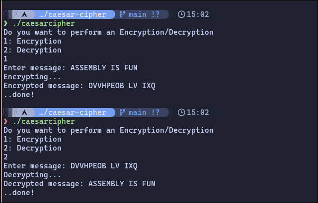

# Caesar Cipher

Assembly language(ASM) implementation of the Caesar Cipher algorithm.

## Screenshots

## How it works

The program takes input text data from stdin and print the encryption and decryption text on stdout.
